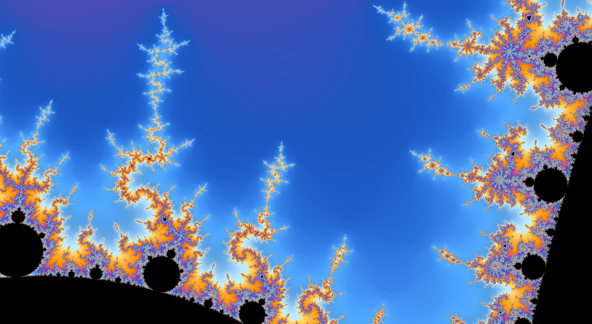

# Fractal Generator

Explore various fractals through a real-time rendered and interactive environment. 
This project was started as a learning exercise in C++ and [SFML](https://www.sfml-dev.org/documentation/3.0.2/)/[OpenGL](https://www.opengl.org/Documentation/Specs.html) and thus has
some optimization/precision errors due to the naïve beginners approach of rendering the fractals, this namely being the ["escape time"](https://en.wikipedia.org/wiki/Plotting_algorithms_for_the_Mandelbrot_set) 
algorithim However, I am currently working on a better implementation.

### Rendering of the Julia Set Fractal (c value varies over time).

  

## What are Fractals?
Fractals are a kind of shape containing detail at very small scales, derived from recursion. Two of the most popular fractals are known as the [Mandelbrot Set](https://en.wikipedia.org/wiki/Mandelbrot_set) and its counterpart the [Julia Set](https://en.wikipedia.org/wiki/Julia_set). These two fractals are famous for their self similarity and cross similarity between one another.

### Mandelbrot Set
In order to render the Mandelbrot set, we use its equation and a set of simple rules. The equation is quite simple: 

$$ z_{n+1} = z^2_n + c, z_0 = 0$$

Where the values of z and c lie in the complex number plane.

The rules are as followed:
- Start with z = 0 and select a value for c.
- Iterate through the equation above multiple times.
  - If the value of z remains bounded for all n > 0, c is a member of the set and color its position black.
  - If the value of z diverges, color the position of c a different color based on how fast it diverges. 

Complete this series of calculations and coloring for every value c in the complex plane and you have the Mandelbrot set fractal!

### Julia Set
The Julia Set is derived from the same equation as the Mandelbrot set. However, its rules are slightly different, and thus we get a different shape.

$$ z_{n+1} = z^2_n + c$$

The rules are as followed:
- Select a fixed value for c, and select a value for z
- Iterate through the equation multiple times.
  - If the iterations remain bounded, color the initial z value black
  - If the iterations diverge, color the initial z value a different color based on how fast it diverges.

Like the Mandelbrot set, complete this series of steps for every initial z value in the complex plane and you get the Julia set.

## Compatibility
This project was built using C++ and SFML on a Windows-based computer. The code is compiled using the g++ compiler and I haven't tested it yet on Mac, however you're welcome to clone the repo and give it a try.
With that being said, the easiest way to ensure compatibility would be to use the same compiler and OS. Using the [MSYS2 UCRT64](https://www.msys2.org/docs/package-management/) command terminal, we can run the following
command to download SFML on the compiler path: `pacman -S mingw-w64-x86_64-sfml`. Additional setup steps can be found on the [SFML website](https://www.sfml-dev.org/download/sfml/3.0.2/).

Next, we need to compile the program in order to use it. In a terminal prompt, make sure you're in the 'src' project directory and run the following command:

`g++ main.cpp -I util -I shaders -lsfml-graphics -lsfml-window -lsfml-system -lopengl32 -o FractalGen`

Then it can be run using `./FractalGen`. If all has been done properly, a window should appear along with the Mandelbrot set rendering. I am currently working on compatibility of MacOS and making the software more accessible.

## Controls
* Esc - Exit window
* Left Mouse - Drag to pan view
* Middle Mouse - Toggle cursor visible
* Scroll Wheel - Zoom in and out
* R - Reset view
* 1 - Mandelbrot Set
* 2 - Burning Ship
* 3 - Feather Fractal (Expensive preformance wise, working on optimizing)
* 4 - 'Mandelbar' Fractal
* 5 - Wavy Fractal
* 6 - Phoenix Fractal
* J - Press once, hover mouse over a point and left click to render Julia set. Press J again to return to 'Mandelbrot' like fractals.
* Spacebar - Toggle julia set animation
* C - Toggle color (Switches between 2 palettes. Working on support for custom palettes)
* F - Toggle fullscreen
* S - Save screenshot

## Demonstration of Rendering Julia Sets

  

## Gallery

  
  
  

## References
1. [SFML Documentation](https://www.sfml-dev.org/documentation/3.0.2/) for learning how to render the fractals
2. [OpenGL Documentation](https://www.opengl.org/Documentation/Specs.html) for learning to write in GLSL shader language
3. [Fractal Plotting Algorithims](https://en.wikipedia.org/wiki/Plotting_algorithms_for_the_Mandelbrot_set) for use of the "Escape time" Algorithim
